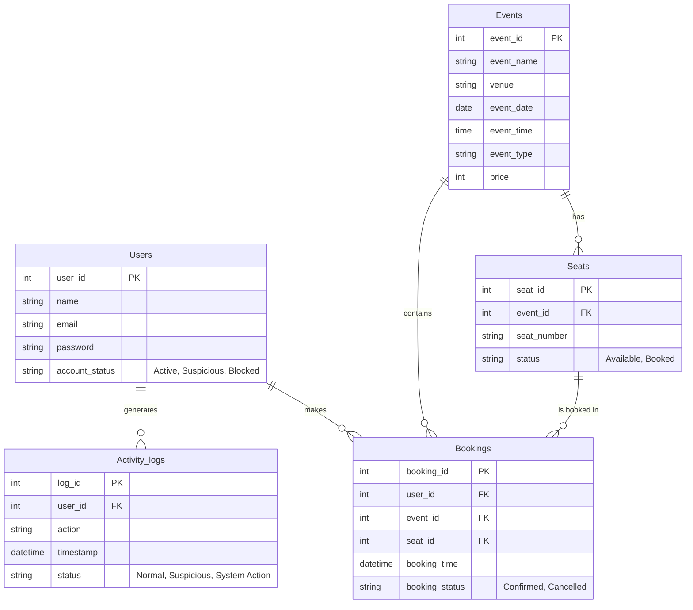

# Database Documentation

This document provide a comprehensive overview of the **fraud_booking_system** database schema, its structure, normalization, and the relationships between various entities.

## 1. ER Diagram

The following Entity-Relationship diagram illustrates the core entities and their relationships within the system.

---

## 2. Table Explanations

### `Users` Table
Stores authentication details and the status of the user's account. This is central to the fraud detection system.
- **`user_id`**: Unique identifier for each user.
- **`name`**: Full name of the user.
- **`email`**: Unique email address used for login.
- **`password`**: Hashed password for security.
- **`account_status`**: Tracks the safety of the account (`Active`, `Suspicious`, or `Blocked`). Accounts can be blocked automatically by triggers or manually by admins.

### `Events` Table
Contains details about the shows, screenings, or conferences available for booking.
- **`event_id`**: Unique identifier for the event.
- **`event_name`**: The name of the movie or event.
- **`venue`**: The location where the event takes place.
- **`event_date` & `event_time`**: Scheduling information.
- **`event_type`**: Category of the event (e.g., Movie, Conference).
- **`price`**: Cost per seat for the specific event.

### `Seats` Table
Represents individual seats for each event. It prevents double-booking through unique constraints.
- **`seat_id`**: Unique identifier for the seat.
- **`event_id`**: Relation to the specific event.
- **`seat_number`**: Structural ID (e.g., 'A1', 'B5').
- **`status`**: Current availability of the seat.

### `Bookings` Table
The transaction table that links users, events, and seats.
- **`booking_id`**: Unique identifier for the booking.
- **`user_id`**: The user who made the reservation.
- **`event_id`**: The event being booked.
- **`seat_id`**: The specific seat reserved.
- **`booking_time`**: Timestamp of when the booking was made.

### `Activity_logs` Table
A specialized logging table used to track behavior and trigger fraud detection logic.
- **`log_id`**: Unique identifier for the log entry.
- **`user_id`**: The user performing the action.
- **`action`**: Description of what occurred (e.g., "Booked seat A1").
- **`timestamp`**: Precisely when the action happened.
- **`status`**: Classification of the action (`Normal` or `Suspicious`).

---

## 3. Database Normalization

The database has been designed following the principles of normalization to ensure data integrity and minimize redundancy.

### First Normal Form (1NF)
- **Primary Keys**: Every table has a unique `id` (e.g., `user_id`, `event_id`) as its primary key.
- **Atomicity**: Each field contains atomic values (e.g., `name` is a single string, `event_date` is a single date). There are no multi-valued attributes or repeating groups.

### Second Normal Form (2NF)
- **Partial Dependency Removal**: Every non-key attribute is fully functionally dependent on the primary key. For example, in the `Seats` table, the `status` depends entirely on `seat_id`. The unique constraint on `(event_id, seat_number)` ensures no redundant seat definitions exist for the same event.

### Third Normal Form (3NF)
- **Transitive Dependency Removal**: There are no transitive dependencies. Non-key attributes do not depend on other non-key attributes. 
    - *Example*: In the `Bookings` table, we only store `user_id` and `event_id`. We do **not** store the user's name or the event's venue in the `Bookings` table, as those should be retrieved via joins from their respective tables. This prevents data inconsistency if a user's name or a venue changes.

---

## 4. Fraud Detection Mechanism (Triggers)

The system utilizes an **SQL Trigger** (`After_Booking_Insert`) to monitor real-time activity:
1. Every time a new record is added to `Bookings`, the trigger logs the action.
2. It immediately checks if the user has made **more than 5 bookings in the last 1 minute**.
3. If this threshold is crossed, the trigger automatically updates the user's `account_status` to **'Blocked'** and logs a 'Suspicious' activity entry.
